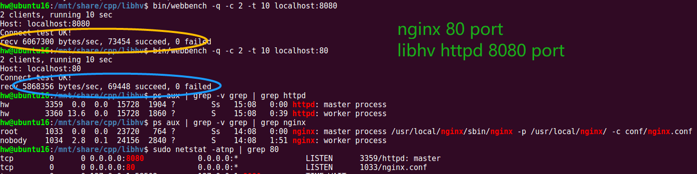

[English](README.md) | 中文

# libhv

[](.github/workflows/CI.yml)
[](https://github.com/ithewei/libhv/actions/workflows/CI.yml?query=branch%3Amaster)
[](https://github.com/ithewei/libhv/actions/workflows/benchmark.yml?query=branch%3Amaster)
<br>
[](https://github.com/ithewei/libhv/releases)
[](https://github.com/ithewei/libhv/stargazers)
[](https://github.com/ithewei/libhv/network/members)
[](https://github.com/ithewei/libhv/issues)
[](https://github.com/ithewei/libhv/pulls)
[](LICENSE)
<br>
[](https://gitee.com/libhv/libhv)
[](https://github.com/oz123/awesome-c)
[](https://github.com/fffaraz/awesome-cpp)

`libhv`是一个类似于`libevent、libev、libuv`的跨平台网络库，提供了更易用的接口和更丰富的协议。

## ✨ 特征

- 跨平台（Linux, Windows, MacOS, Solaris）
- 高性能事件循环（网络IO事件、定时器事件、空闲事件、自定义事件）
- TCP/UDP服务端/客户端/代理
- TCP支持心跳、转发、拆包、多线程安全write和close等特性
- SSL/TLS加密通信（可选WITH_OPENSSL、WITH_GNUTLS、WITH_MBEDTLS）
- HTTP服务端/客户端（支持https http1/x http2 grpc）
- HTTP支持静态文件服务、目录服务、同步/异步API处理函数
- HTTP支持RESTful风格、URI路由、keep-alive长连接、chunked分块等特性
- WebSocket服务端/客户端

## ⌛️ 构建

见[BUILD.md](BUILD.md)

libhv提供了以下构建方式:

1、通过Makefile:
```shell
./configure
make
sudo make install
```

2、通过cmake:
```shell
mkdir build
cd build
cmake ..
cmake --build .
```

3、通过vcpkg:
```shell
vcpkg install libhv
```

4、通过xmake:
```shell
xrepo install libhv
```

## ⚡️ 入门与体验

运行脚本`./getting_started.sh`:

```shell
# 下载编译
git clone https://github.com/ithewei/libhv.git
cd libhv
make

# 运行httpd服务
bin/httpd -h
bin/httpd -d
#bin/httpd -c etc/httpd.conf -s restart -d
ps aux | grep httpd

# 文件服务
bin/curl -v localhost:8080

# 目录服务
bin/curl -v localhost:8080/downloads/

# API服务
bin/curl -v localhost:8080/ping
bin/curl -v localhost:8080/echo -d "hello,world!"
bin/curl -v localhost:8080/query?page_no=1\&page_size=10
bin/curl -v localhost:8080/kv   -H "Content-Type:application/x-www-form-urlencoded" -d 'user=admin&pswd=123456'
bin/curl -v localhost:8080/json -H "Content-Type:application/json" -d '{"user":"admin","pswd":"123456"}'
bin/curl -v localhost:8080/form -F "user=admin pswd=123456"
bin/curl -v localhost:8080/upload -F "file=@LICENSE"

bin/curl -v localhost:8080/test -H "Content-Type:application/x-www-form-urlencoded" -d 'bool=1&int=123&float=3.14&string=hello'
bin/curl -v localhost:8080/test -H "Content-Type:application/json" -d '{"bool":true,"int":123,"float":3.14,"string":"hello"}'
bin/curl -v localhost:8080/test -F 'bool=1 int=123 float=3.14 string=hello'
# RESTful API: /group/:group_name/user/:user_id
bin/curl -v -X DELETE localhost:8080/group/test/user/123
```

### HTTP
#### HTTP服务端
见[examples/http_server_test.cpp](examples/http_server_test.cpp)

**golang gin style**
```c++
#include "HttpServer.h"

int main() {
    HttpService router;
    router.GET("/ping", [](HttpRequest* req, HttpResponse* resp) {
        return resp->String("pong");
    });

    router.GET("/data", [](HttpRequest* req, HttpResponse* resp) {
        static char data[] = "0123456789";
        return resp->Data(data, 10);
    });

    router.GET("/paths", [&router](HttpRequest* req, HttpResponse* resp) {
        return resp->Json(router.Paths());
    });

    router.GET("/get", [](HttpRequest* req, HttpResponse* resp) {
        resp->json["origin"] = req->client_addr.ip;
        resp->json["url"] = req->url;
        resp->json["args"] = req->query_params;
        resp->json["headers"] = req->headers;
        return 200;
    });

    router.POST("/echo", [](const HttpContextPtr& ctx) {
        return ctx->send(ctx->body(), ctx->type());
    });

    http_server_t server;
    server.port = 8080;
    server.service = &router;
    http_server_run(&server);
    return 0;
}
```
#### HTTP客户端
见[examples/http_client_test.cpp](examples/http_client_test.cpp)

**python requests style**
```c++
#include "requests.h"

int main() {
    auto resp = requests::get("http://www.example.com");
    if (resp == NULL) {
        printf("request failed!\n");
    } else {
        printf("%s\n", resp->body.c_str());
    }

    resp = requests::post("127.0.0.1:8080/echo", "hello,world!");
    if (resp == NULL) {
        printf("request failed!\n");
    } else {
        printf("%s\n", resp->body.c_str());
    }

    return 0;
}
```

**js axios style**
```c++
#include "axios.h"

int main() {
    const char* strReq = R"({
        "method": "POST",
        "url": "http://127.0.0.1:8080/echo",
        "params": {
            "page_no": "1",
            "page_size": "10"
        },
        "headers": {
            "Content-Type": "application/json"
        },
        "body": {
            "app_id": "123456",
            "app_secret": "abcdefg"
        }
    })";

    // sync
    auto resp = axios::axios(strReq);
    if (resp == NULL) {
        printf("request failed!\n");
    } else {
        printf("%s\n", resp->body.c_str());
    }

    // async
    int finished = 0;
    axios::axios(strReq, [&finished](const HttpResponsePtr& resp) {
        if (resp == NULL) {
            printf("request failed!\n");
        } else {
            printf("%s\n", resp->body.c_str());
        }
        finished = 1;
    });

    // wait async finished
    while (!finished) hv_sleep(1);
    return 0;
}
```

#### HTTP压测
```shell
# sudo apt install wrk
wrk -c 100 -t 4 -d 10s http://127.0.0.1:8080/

# sudo apt install apache2-utils
ab -c 100 -n 100000 http://127.0.0.1:8080/
```

**libhv(port:8080) vs nginx(port:80)**


## 🍭 示例

### c版本
- 事件循环: [examples/hloop_test.c](examples/hloop_test.c)
- TCP回显服务:  [examples/tcp_echo_server.c](examples/tcp_echo_server.c)
- TCP聊天服务:  [examples/tcp_chat_server.c](examples/tcp_chat_server.c)
- TCP代理服务:  [examples/tcp_proxy_server.c](examples/tcp_proxy_server.c)
- UDP回显服务:  [examples/udp_echo_server.c](examples/udp_echo_server.c)
- UDP代理服务:  [examples/udp_proxy_server.c](examples/udp_proxy_server.c)
- jsonRPC示例:  [examples/jsonrpc](examples/jsonrpc)
- 多accept进程模式: [examples/multi-thread/multi-acceptor-processes.c](examples/multi-thread/multi-acceptor-processes.c)
- 多accept线程模式: [examples/multi-thread/multi-acceptor-threads.c](examples/multi-thread/multi-acceptor-threads.c)
- 一个accept线程+多worker线程: [examples/multi-thread/one-acceptor-multi-workers.c](examples/multi-thread/one-acceptor-multi-workers.c)

### c++版本
- 事件循环: [evpp/EventLoop_test.cpp](evpp/EventLoop_test.cpp)
- 事件循环线程: [evpp/EventLoopThread_test.cpp](evpp/EventLoopThread_test.cpp)
- 事件循环线程池: [evpp/EventLoopThreadPool_test.cpp](evpp/EventLoopThreadPool_test.cpp)
- TCP服务端: [evpp/TcpServer_test.cpp](evpp/TcpServer_test.cpp)
- TCP客户端: [evpp/TcpClient_test.cpp](evpp/TcpClient_test.cpp)
- UDP服务端: [evpp/UdpServer_test.cpp](evpp/UdpServer_test.cpp)
- UDP客户端: [evpp/UdpClient_test.cpp](evpp/UdpClient_test.cpp)
- HTTP服务端: [examples/http_server_test.cpp](examples/http_server_test.cpp)
- HTTP客户端: [examples/http_client_test.cpp](examples/http_client_test.cpp)
- WebSocket服务端: [examples/websocket_server_test.cpp](examples/websocket_server_test.cpp)
- WebSocket客户端: [examples/websocket_client_test.cpp](examples/websocket_client_test.cpp)
- protobufRPC示例: [examples/protorpc](examples/protorpc)

### 模拟实现著名的命令行工具
- 网络连接工具: [examples/nc](examples/nc.c)
- 网络扫描工具: [examples/nmap](examples/nmap)
- HTTP服务程序: [examples/httpd](examples/httpd)
- URL请求工具: [examples/curl](examples/curl.cpp)
- 文件下载工具: [examples/wget](examples/wget.cpp)
- 服务注册与发现: [examples/consul](examples/consul)

## 🥇 性能测试
```shell
cd echo-servers
./build.sh
./benchmark.sh
```

**吞吐量**:
```shell
libevent running on port 2001
libev running on port 2002
libuv running on port 2003
libhv running on port 2004
asio running on port 2005
poco running on port 2006

==============2001=====================================
[127.0.0.1:2001] 4 threads 1000 connections run 10s
total readcount=1616761 readbytes=1655563264
throughput = 157 MB/s

==============2002=====================================
[127.0.0.1:2002] 4 threads 1000 connections run 10s
total readcount=2153171 readbytes=2204847104
throughput = 210 MB/s

==============2003=====================================
[127.0.0.1:2003] 4 threads 1000 connections run 10s
total readcount=1599727 readbytes=1638120448
throughput = 156 MB/s

==============2004=====================================
[127.0.0.1:2004] 4 threads 1000 connections run 10s
total readcount=2202271 readbytes=2255125504
throughput = 215 MB/s

==============2005=====================================
[127.0.0.1:2005] 4 threads 1000 connections run 10s
total readcount=1354230 readbytes=1386731520
throughput = 132 MB/s

==============2006=====================================
[127.0.0.1:2006] 4 threads 1000 connections run 10s
total readcount=1699652 readbytes=1740443648
throughput = 165 MB/s
```

## 📚 中文资料

- **libhv 教程**: <https://hewei.blog.csdn.net/article/details/113733758>
- **libhv QQ群**: `739352073`，欢迎加群交流

## 💎 用户案例

如果您在使用`libhv`，欢迎通过PR将信息提交至此列表，让更多的用户了解`libhv`的实际使用场景，以建立更好的网络生态。

| 用户 (公司名/项目名/个人联系方式) | 案例 (项目简介/业务场景) |
| :--- | :--- |
| [阅面科技](https://www.readsense.cn) | [猎户AIoT平台](https://orionweb.readsense.cn)设备管理、人脸检测HTTP服务、人脸搜索HTTP服务 |
| [socks5-libhv](https://gitee.com/billykang/socks5-libhv) | socks5代理 |
| [hvloop](https://github.com/xiispace/hvloop) | 类似[uvloop](https://github.com/MagicStack/uvloop)的python异步IO事件循环 |

