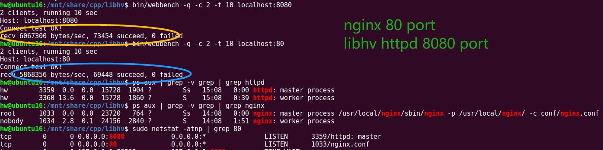

[English](README.md) | 中文

# libhv

[](https://github.com/ithewei/libhv/actions/workflows/CI.yml?query=branch%3Amaster)
[](https://github.com/ithewei/libhv/actions/workflows/CI.yml?query=branch%3Amaster)
[](https://github.com/ithewei/libhv/actions/workflows/CI.yml?query=branch%3Amaster)
[](https://github.com/ithewei/libhv/actions/workflows/CI.yml?query=branch%3Amaster)
[](https://github.com/ithewei/libhv/actions/workflows/CI.yml?query=branch%3Amaster)
[](https://github.com/ithewei/libhv/actions/workflows/benchmark.yml?query=branch%3Amaster)
<br>
[](https://github.com/ithewei/libhv/releases)
[](https://github.com/ithewei/libhv/stargazers)
[](https://github.com/ithewei/libhv/forks)
[](https://github.com/ithewei/libhv/issues)
[](https://github.com/ithewei/libhv/pulls)
[](https://github.com/ithewei/libhv/contributors)
[](LICENSE)
<br>
[](https://gitee.com/libhv/libhv)
[](https://github.com/oz123/awesome-c)
[](https://github.com/fffaraz/awesome-cpp)

`libhv`是一个类似于`libevent、libev、libuv`的跨平台网络库，提供了更易用的接口和更丰富的协议。

## 📚 中文资料

- **libhv QQ群**: `739352073`，欢迎加群交流
- **libhv 源码剖析**: <https://hewei.blog.csdn.net/article/details/123295998>
- **libhv 接口手册**: <https://hewei.blog.csdn.net/article/details/103976875>
- **libhv 教程目录**: <https://hewei.blog.csdn.net/article/details/113733758>
- [libhv教程01--介绍与体验](https://hewei.blog.csdn.net/article/details/113702536)
- [libhv教程02--编译与安装](https://hewei.blog.csdn.net/article/details/113704737)
- [libhv教程03--链库与使用](https://hewei.blog.csdn.net/article/details/113706378)
- [libhv教程04--编写一个完整的命令行程序](https://hewei.blog.csdn.net/article/details/113719503)
- [libhv教程05--事件循环以及定时器的简单使用](https://hewei.blog.csdn.net/article/details/113724474)
- [libhv教程06--创建一个简单的TCP服务端](https://hewei.blog.csdn.net/article/details/113737580)
- [libhv教程07--创建一个简单的TCP客户端](https://hewei.blog.csdn.net/article/details/113738900)
- [libhv教程08--创建一个简单的UDP服务端](https://hewei.blog.csdn.net/article/details/113871498)
- [libhv教程09--创建一个简单的UDP客户端](https://hewei.blog.csdn.net/article/details/113871724)
- [libhv教程10--创建一个简单的HTTP服务端](https://hewei.blog.csdn.net/article/details/113982999)
- [libhv教程11--创建一个简单的HTTP客户端](https://hewei.blog.csdn.net/article/details/113984302)
- [libhv教程12--创建一个简单的WebSocket服务端](https://hewei.blog.csdn.net/article/details/113985321)
- [libhv教程13--创建一个简单的WebSocket客户端](https://hewei.blog.csdn.net/article/details/113985895)
- [libhv教程14--200行实现一个纯C版jsonrpc框架](https://hewei.blog.csdn.net/article/details/119920540)
- [libhv教程15--200行实现一个C++版protorpc框架](https://hewei.blog.csdn.net/article/details/119966701)
- [libhv教程16--多线程/多进程服务端编程](https://hewei.blog.csdn.net/article/details/120366024)
- [libhv教程17--Qt中使用libhv](https://hewei.blog.csdn.net/article/details/120699890)
- [libhv教程18--动手写一个tinyhttpd](https://hewei.blog.csdn.net/article/details/121706604)
- [libhv教程19--MQTT的实现与使用](https://hewei.blog.csdn.net/article/details/122753665)

## ✨ 特性

- 跨平台（Linux, Windows, macOS, Android, iOS, BSD, Solaris）
- 高性能事件循环（网络IO事件、定时器事件、空闲事件、自定义事件、信号）
- TCP/UDP服务端/客户端/代理
- TCP支持心跳、重连、转发、多线程安全write和close等特性
- 内置常见的拆包模式（固定包长、分界符、头部长度字段）
- 可靠UDP支持: WITH_KCP
- SSL/TLS加密通信（可选WITH_OPENSSL、WITH_GNUTLS、WITH_MBEDTLS）
- HTTP服务端/客户端（支持https http1/x http2 grpc）
- HTTP支持静态文件服务、目录服务、正向/反向代理服务、同步/异步API处理器
- HTTP支持RESTful风格、路由、中间件、keep-alive长连接、chunked分块、SSE等特性
- WebSocket服务端/客户端
- MQTT客户端
- Redis客户端

## ⌛️ 构建

见[BUILD.md](BUILD.md)

libhv提供了以下构建方式:

1、通过Makefile:
```shell
./configure
make
sudo make install
```

2、通过cmake:
```shell
mkdir build
cd build
cmake ..
cmake --build .
```

3、通过bazel:
```shell
bazel build libhv
```

4、通过vcpkg:
```shell
vcpkg install libhv
```

5、通过xmake:
```shell
xrepo install libhv
```

## ⚡️ 快速入门

### 体验
运行脚本`./getting_started.sh`:

```shell
# 下载编译
git clone https://github.com/ithewei/libhv.git
cd libhv
./configure
make

# 运行httpd服务
bin/httpd -h
bin/httpd -d
#bin/httpd -c etc/httpd.conf -s restart -d
ps aux | grep httpd

# 文件服务
bin/curl -v localhost:8080

# 目录服务
bin/curl -v localhost:8080/downloads/

# API服务
bin/curl -v localhost:8080/ping
bin/curl -v localhost:8080/echo -d "hello,world!"
bin/curl -v localhost:8080/query?page_no=1\&page_size=10
bin/curl -v localhost:8080/kv   -H "Content-Type:application/x-www-form-urlencoded" -d 'user=admin&pswd=123456'
bin/curl -v localhost:8080/json -H "Content-Type:application/json" -d '{"user":"admin","pswd":"123456"}'
bin/curl -v localhost:8080/form -F 'user=admin' -F 'pswd=123456'
bin/curl -v localhost:8080/upload -d "@LICENSE"
bin/curl -v localhost:8080/upload -F "file=@LICENSE"

bin/curl -v localhost:8080/test -H "Content-Type:application/x-www-form-urlencoded" -d 'bool=1&int=123&float=3.14&string=hello'
bin/curl -v localhost:8080/test -H "Content-Type:application/json" -d '{"bool":true,"int":123,"float":3.14,"string":"hello"}'
bin/curl -v localhost:8080/test -F 'bool=1' -F 'int=123' -F 'float=3.14' -F 'string=hello'
# RESTful API: /group/:group_name/user/:user_id
bin/curl -v -X DELETE localhost:8080/group/test/user/123

# 压力测试
bin/wrk -c 1000 -d 10 -t 4 http://127.0.0.1:8080/
```

### TCP
#### TCP服务端
**c版本**: [examples/tcp_echo_server.c](examples/tcp_echo_server.c)

**c++版本**: [evpp/TcpServer_test.cpp](evpp/TcpServer_test.cpp)
```c++
#include "TcpServer.h"
using namespace hv;

int main() {
    int port = 1234;
    TcpServer srv;
    int listenfd = srv.createsocket(port);
    if (listenfd < 0) {
        return -1;
    }
    printf("server listen on port %d, listenfd=%d ...\n", port, listenfd);
    srv.onConnection = [](const SocketChannelPtr& channel) {
        std::string peeraddr = channel->peeraddr();
        if (channel->isConnected()) {
            printf("%s connected! connfd=%d\n", peeraddr.c_str(), channel->fd());
        } else {
            printf("%s disconnected! connfd=%d\n", peeraddr.c_str(), channel->fd());
        }
    };
    srv.onMessage = [](const SocketChannelPtr& channel, Buffer* buf) {
        // echo
        channel->write(buf);
    };
    srv.setThreadNum(4);
    srv.start();

    // press Enter to stop
    while (getchar() != '\n');
    return 0;
}
```

**注意**:

以上示例只是简单的`echo`服务，TCP是流式协议，实际应用中请务必添加边界进行拆包。<br>
文本协议建议加上`\0`或者`\r\n`分隔符，可参考 [examples/jsonrpc](examples/jsonrpc);<br>
二进制协议建议加上自定义协议头，通过头部长度字段表明负载长度，可参考 [examples/protorpc](examples/protorpc);<br>
通过`setUnpack`（c接口即`hio_set_unpack`）设置拆包规则，支持固定包长、分隔符、头部长度字段三种常见的拆包方式，<br>
内部根据拆包规则处理粘包与分包，保证`onMessage`回调上来的是完整的一包数据，大大节省了上层处理粘包与分包的成本。<br>
不想自定义协议和拆包组包的可直接使用现成的`HTTP/WebSocket`协议。<br>
<br>
`channel->write`（c接口即`hio_write`）是非阻塞的（事件循环异步编程里所有的一切都要求是非阻塞的），且多线程安全的。<br>
发送大数据时应该做流控，通过`onWriteComplete`监听写完成事件，在可写时再发送下一帧数据。<br>
具体示例代码可参考 [examples/tinyhttpd.c](examples/tinyhttpd.c) 中的 `http_serve_file`。<br>
<br>
`channel->close`（c接口即`hio_close`) 也是多线程安全的，这可以让网络IO事件循环线程里接收数据、拆包组包、反序列化后放入队列，<br>
消费者线程/线程池从队列里取出数据、处理后发送响应和关闭连接，变得更加简单。<br>

#### TCP客户端
**c版本**: [examples/tcp_client_test.c](examples/tcp_client_test.c)

**c++版本**: [evpp/TcpClient_test.cpp](evpp/TcpClient_test.cpp)
```c++
#include <iostream>
#include "TcpClient.h"
using namespace hv;

int main() {
    int port = 1234;
    TcpClient cli;
    int connfd = cli.createsocket(port);
    if (connfd < 0) {
        return -1;
    }
    cli.onConnection = [](const SocketChannelPtr& channel) {
        std::string peeraddr = channel->peeraddr();
        if (channel->isConnected()) {
            printf("connected to %s! connfd=%d\n", peeraddr.c_str(), channel->fd());
        } else {
            printf("disconnected to %s! connfd=%d\n", peeraddr.c_str(), channel->fd());
        }
    };
    cli.onMessage = [](const SocketChannelPtr& channel, Buffer* buf) {
        printf("< %.*s\n", (int)buf->size(), (char*)buf->data());
    };
    cli.start();

    std::string str;
    while (std::getline(std::cin, str)) {
        if (str == "close") {
            cli.closesocket();
        } else if (str == "start") {
            cli.start();
        } else if (str == "stop") {
            cli.stop();
            break;
        } else {
            if (!cli.isConnected()) break;
            cli.send(str);
        }
    }
    return 0;
}
```

### HTTP
#### HTTP服务端
见[examples/http_server_test.cpp](examples/http_server_test.cpp)

**golang gin 风格**
```c++
#include "HttpServer.h"
using namespace hv;

int main() {
    HttpService router;
    router.GET("/ping", [](HttpRequest* req, HttpResponse* resp) {
        return resp->String("pong");
    });

    router.GET("/data", [](HttpRequest* req, HttpResponse* resp) {
        static char data[] = "0123456789";
        return resp->Data(data, 10);
    });

    router.GET("/paths", [&router](HttpRequest* req, HttpResponse* resp) {
        return resp->Json(router.Paths());
    });

    router.GET("/get", [](HttpRequest* req, HttpResponse* resp) {
        resp->json["origin"] = req->client_addr.ip;
        resp->json["url"] = req->url;
        resp->json["args"] = req->query_params;
        resp->json["headers"] = req->headers;
        return 200;
    });

    router.POST("/echo", [](const HttpContextPtr& ctx) {
        return ctx->send(ctx->body(), ctx->type());
    });

    HttpServer server(&router);
    server.setPort(8080);
    server.setThreadNum(4);
    server.run();
    return 0;
}
```

**注意**:

上面示例直接运行在`main`主线程，`server.run()`会阻塞当前线程运行，所以`router`和`server`对象不会被析构，<br>
如使用`server.start()`内部会另起线程运行，不会阻塞当前线程，但需要注意`router`和`server`的生命周期，<br>
不要定义为局部变量被析构了，可定义为类成员变量或者全局变量，下面的`WebSocket`服务同理。<br>

#### HTTP客户端
见[examples/http_client_test.cpp](examples/http_client_test.cpp)

**python requests 风格**
```c++
#include "requests.h"

int main() {
    auto resp = requests::get("http://www.example.com");
    if (resp == NULL) {
        printf("request failed!\n");
    } else {
        printf("%s\n", resp->body.c_str());
    }

    resp = requests::post("127.0.0.1:8080/echo", "hello,world!");
    if (resp == NULL) {
        printf("request failed!\n");
    } else {
        printf("%s\n", resp->body.c_str());
    }

    return 0;
}
```

附HTTP相关接口文档:

- [class HttpMessage](docs/cn/HttpMessage.md)
- [class HttpClient](docs/cn/HttpClient.md)
- [class HttpServer](docs/cn/HttpServer.md)
- [class HttpContext](docs/cn/HttpContext.md)

### WebSocket
#### WebSocket服务端
见[examples/websocket_server_test.cpp](examples/websocket_server_test.cpp)
```c++
#include "WebSocketServer.h"
using namespace hv;

int main(int argc, char** argv) {
    WebSocketService ws;
    ws.onopen = [](const WebSocketChannelPtr& channel, const HttpRequestPtr& req) {
        printf("onopen: GET %s\n", req->Path().c_str());
    };
    ws.onmessage = [](const WebSocketChannelPtr& channel, const std::string& msg) {
        printf("onmessage: %.*s\n", (int)msg.size(), msg.data());
    };
    ws.onclose = [](const WebSocketChannelPtr& channel) {
        printf("onclose\n");
    };

    WebSocketServer server(&ws);
    server.setPort(9999);
    server.setThreadNum(4);
    server.run();
    return 0;
}
```

#### WebSocket客户端
见[examples/websocket_client_test.cpp](examples/websocket_client_test.cpp)
```c++
#include "WebSocketClient.h"
using namespace hv;

int main(int argc, char** argv) {
    WebSocketClient ws;
    ws.onopen = []() {
        printf("onopen\n");
    };
    ws.onmessage = [](const std::string& msg) {
        printf("onmessage: %.*s\n", (int)msg.size(), msg.data());
    };
    ws.onclose = []() {
        printf("onclose\n");
    };

    // reconnect: 1,2,4,8,10,10,10...
    reconn_setting_t reconn;
    reconn_setting_init(&reconn);
    reconn.min_delay = 1000;
    reconn.max_delay = 10000;
    reconn.delay_policy = 2;
    ws.setReconnect(&reconn);

    ws.open("ws://127.0.0.1:9999/test");

    std::string str;
    while (std::getline(std::cin, str)) {
        if (!ws.isConnected()) break;
        if (str == "quit") {
            ws.close();
            break;
        }
        ws.send(str);
    }

    return 0;
}
```

### Redis
见 [examples/redis_client_test.cpp](examples/redis_client_test.cpp) 和 [examples/redis_subscriber_test.cpp](examples/redis_subscriber_test.cpp)

Redis C++ 模块位于仓库根目录 `redis/`，并采用 `.h + .cpp` 分离结构。Redis 默认不编译，需要显式使用 `./configure --with-redis` 或 `cmake -DWITH_REDIS=ON` 打开。

```shell
./configure --with-redis
make unittest
cmake -S . -B build -DWITH_EVPP=ON -DWITH_REDIS=ON -DBUILD_UNITTEST=ON
cmake --build build --target redis_protocol_test redis_async_client_test redis_client_test redis_batch_test redis_subscriber_test
```

## 🍭 更多示例

### c版本
- 事件循环:     [examples/hloop_test.c](examples/hloop_test.c)
- 定时器:       [examples/htimer_test.c](examples/htimer_test.c)
- pipe示例:     [examples/pipe_test.c](examples/pipe_test.c)
- TCP回显服务:  [examples/tcp_echo_server.c](examples/tcp_echo_server.c)
- TCP聊天服务:  [examples/tcp_chat_server.c](examples/tcp_chat_server.c)
- TCP代理服务:  [examples/tcp_proxy_server.c](examples/tcp_proxy_server.c)
- UDP回显服务:  [examples/udp_echo_server.c](examples/udp_echo_server.c)
- UDP代理服务:  [examples/udp_proxy_server.c](examples/udp_proxy_server.c)
- SOCKS5代理服务: [examples/socks5_proxy_server.c](examples/socks5_proxy_server.c)
- HTTP服务:     [examples/tinyhttpd.c](examples/tinyhttpd.c)
- HTTP代理服务: [examples/tinyproxyd.c](examples/tinyproxyd.c)
- jsonRPC示例:  [examples/jsonrpc](examples/jsonrpc)
- MQTT示例:     [examples/mqtt](examples/mqtt)
- 多accept进程模式: [examples/multi-thread/multi-acceptor-processes.c](examples/multi-thread/multi-acceptor-processes.c)
- 多accept线程模式: [examples/multi-thread/multi-acceptor-threads.c](examples/multi-thread/multi-acceptor-threads.c)
- 一个accept线程+多worker线程: [examples/multi-thread/one-acceptor-multi-workers.c](examples/multi-thread/one-acceptor-multi-workers.c)

### c++版本
- 事件循环: [evpp/EventLoop_test.cpp](evpp/EventLoop_test.cpp)
- 事件循环线程: [evpp/EventLoopThread_test.cpp](evpp/EventLoopThread_test.cpp)
- 事件循环线程池: [evpp/EventLoopThreadPool_test.cpp](evpp/EventLoopThreadPool_test.cpp)
- 定时器:    [evpp/TimerThread_test.cpp](evpp/TimerThread_test.cpp)
- TCP服务端: [evpp/TcpServer_test.cpp](evpp/TcpServer_test.cpp)
- TCP客户端: [evpp/TcpClient_test.cpp](evpp/TcpClient_test.cpp)
- UDP服务端: [evpp/UdpServer_test.cpp](evpp/UdpServer_test.cpp)
- UDP客户端: [evpp/UdpClient_test.cpp](evpp/UdpClient_test.cpp)
- HTTP服务端: [examples/http_server_test.cpp](examples/http_server_test.cpp)
- HTTP客户端: [examples/http_client_test.cpp](examples/http_client_test.cpp)
- WebSocket服务端: [examples/websocket_server_test.cpp](examples/websocket_server_test.cpp)
- WebSocket客户端: [examples/websocket_client_test.cpp](examples/websocket_client_test.cpp)
- Redis客户端示例: [examples/redis_client_test.cpp](examples/redis_client_test.cpp)
- Redis订阅示例: [examples/redis_subscriber_test.cpp](examples/redis_subscriber_test.cpp)
- protobufRPC示例: [examples/protorpc](examples/protorpc)
- Qt中使用libhv示例: [hv-projects/QtDemo](https://github.com/hv-projects/QtDemo)

### 模拟实现著名的命令行工具
- 网络连接工具: [examples/nc](examples/nc.c)
- 网络扫描工具: [examples/nmap](examples/nmap)
- HTTP服务程序: [examples/httpd](examples/httpd)
- HTTP压测工具: [examples/wrk](examples/wrk.cpp)
- URL请求工具:  [examples/curl](examples/curl.cpp)
- 文件下载工具: [examples/wget](examples/wget.cpp)
- 服务注册与发现: [examples/consul](examples/consul)
- kcptun隧道: [examples/kcptun](examples/kcptun)

## 🥇 性能测试

### TCP回显服务pingpong测试
```shell
cd echo-servers
./build.sh
./benchmark.sh
```

**吞吐量**:
```shell
libevent running on port 2001
libev running on port 2002
libuv running on port 2003
libhv running on port 2004
asio running on port 2005
poco running on port 2006

==============2001=====================================
[127.0.0.1:2001] 4 threads 1000 connections run 10s
total readcount=1616761 readbytes=1655563264
throughput = 157 MB/s

==============2002=====================================
[127.0.0.1:2002] 4 threads 1000 connections run 10s
total readcount=2153171 readbytes=2204847104
throughput = 210 MB/s

==============2003=====================================
[127.0.0.1:2003] 4 threads 1000 connections run 10s
total readcount=1599727 readbytes=1638120448
throughput = 156 MB/s

==============2004=====================================
[127.0.0.1:2004] 4 threads 1000 connections run 10s
total readcount=2202271 readbytes=2255125504
throughput = 215 MB/s

==============2005=====================================
[127.0.0.1:2005] 4 threads 1000 connections run 10s
total readcount=1354230 readbytes=1386731520
throughput = 132 MB/s

==============2006=====================================
[127.0.0.1:2006] 4 threads 1000 connections run 10s
total readcount=1699652 readbytes=1740443648
throughput = 165 MB/s
```

### TCP代理服务压测

```shell
# sudo apt install iperf
iperf -s -p 5001 > /dev/null &
bin/tcp_proxy_server 1212 127.0.0.1:5001 &
iperf -c 127.0.0.1 -p 5001 -l 8K
iperf -c 127.0.0.1 -p 1212 -l 8K
```

**带宽**:
```shell
------------------------------------------------------------
[  3] local 127.0.0.1 port 52560 connected with 127.0.0.1 port 5001
[ ID] Interval       Transfer     Bandwidth
[  3]  0.0-10.0 sec  20.8 GBytes  17.9 Gbits/sec

------------------------------------------------------------
[  3] local 127.0.0.1 port 48142 connected with 127.0.0.1 port 1212
[ ID] Interval       Transfer     Bandwidth
[  3]  0.0-10.0 sec  11.9 GBytes  10.2 Gbits/sec
```

### HTTP压测
```shell
# sudo apt install wrk
wrk -c 100 -t 4 -d 10s http://127.0.0.1:8080/

# sudo apt install apache2-utils
ab -c 100 -n 100000 http://127.0.0.1:8080/
```

**libhv(port:8080) vs nginx(port:80)**



以上测试结果可以在 [Github Actions](https://github.com/ithewei/libhv/actions/workflows/benchmark.yml) 中查看。

## 💎 用户案例

如果您在使用`libhv`，欢迎通过PR将信息提交至此列表，让更多的用户了解`libhv`的实际使用场景，以建立更好的网络生态。

| 用户 (公司名/项目名/个人联系方式) | 案例 (项目简介/业务场景) |
| :--- | :--- |
| [阅面科技](https://www.readsense.cn) | [猎户AIoT平台](https://orionweb.readsense.cn)设备管理、人脸检测HTTP服务、人脸搜索HTTP服务 |
| [socks5-libhv](https://gitee.com/billykang/socks5-libhv) | socks5代理 |
| [hvloop](https://github.com/xiispace/hvloop) | 类似[uvloop](https://github.com/MagicStack/uvloop)的python异步IO事件循环 |
| [tsproxyd-android](https://github.com/Haiwen-GitHub/tsproxyd-android) | 一个基于libhv实现的android端web代理服务 |
| [玄舟智维](https://zjzwxw.com) | C100K设备连接网关服务 |

