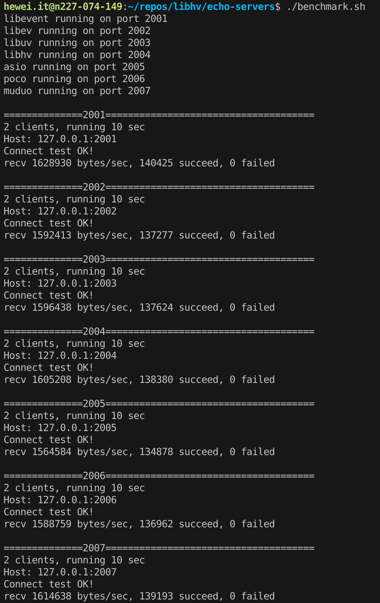

[](https://travis-ci.org/ithewei/libhv)
[](.travis.yml)

[English version](README.md)

## 简介

`libhv`是一个类似于`libevent、libev、libuv`的跨平台网络库，提供了更简单的接口和更丰富的协议。

## 特征

- 跨平台（Linux, Windows, Mac, Solaris）
- 事件循环（IO, timer, idle）
- TCP/UDP服务端/客户端
- SSL/TLS加密通信（WITH_OPENSSL or WITH_MBEDTLS）
- HTTP服务端/客户端（https http1/x http2 grpc）
- HTTP文件服务、目录服务、API服务（支持RESTful）
- WebSocket服务端/客户端

## 入门与体验

运行`./getting_started.sh`:

```shell
git clone https://github.com/ithewei/libhv.git
cd libhv
make httpd curl

bin/httpd -h
bin/httpd -d
#bin/httpd -c etc/httpd.conf -s restart -d
ps aux | grep httpd

# http web service
bin/curl -v localhost:8080

# http indexof service
bin/curl -v localhost:8080/downloads/

# http api service
bin/curl -v localhost:8080/ping
bin/curl -v localhost:8080/echo -d "hello,world!"
bin/curl -v localhost:8080/query?page_no=1\&page_size=10
bin/curl -v localhost:8080/kv   -H "Content-Type:application/x-www-form-urlencoded" -d 'user=admin&pswd=123456'
bin/curl -v localhost:8080/json -H "Content-Type:application/json" -d '{"user":"admin","pswd":"123456"}'
bin/curl -v localhost:8080/form -F "user=admin pswd=123456"
bin/curl -v localhost:8080/upload -F "file=@LICENSE"

bin/curl -v localhost:8080/test -H "Content-Type:application/x-www-form-urlencoded" -d 'bool=1&int=123&float=3.14&string=hello'
bin/curl -v localhost:8080/test -H "Content-Type:application/json" -d '{"bool":true,"int":123,"float":3.14,"string":"hello"}'
bin/curl -v localhost:8080/test -F 'bool=1 int=123 float=3.14 string=hello'
# RESTful API: /group/:group_name/user/:user_id
bin/curl -v -X DELETE localhost:8080/group/test/user/123
```

### HTTP
#### HTTP服务端
见[examples/http_server_test.cpp](examples/http_server_test.cpp)
```c++
#include "HttpServer.h"

int main() {
    HttpService router;
    router.GET("/ping", [](HttpRequest* req, HttpResponse* resp) {
        return resp->String("pong");
    });

    router.GET("/data", [](HttpRequest* req, HttpResponse* resp) {
        static char data[] = "0123456789";
        return resp->Data(data, 10);
    });

    router.GET("/paths", [&router](HttpRequest* req, HttpResponse* resp) {
        return resp->Json(router.Paths());
    });

    router.POST("/echo", [](HttpRequest* req, HttpResponse* resp) {
        resp->content_type = req->content_type;
        resp->body = req->body;
        return 200;
    });

    http_server_t server;
    server.port = 8080;
    server.service = &router;
    http_server_run(&server);
    return 0;
}
```
#### HTTP客户端
见[examples/http_client_test.cpp](examples/http_client_test.cpp)
```c++
#include "requests.h"

int main() {
    auto resp = requests::get("http://www.example.com");
    if (resp == NULL) {
        printf("request failed!\n");
    } else {
        printf("%d %s\r\n", resp->status_code, resp->status_message());
        printf("%s\n", resp->body.c_str());
    }

    resp = requests::post("127.0.0.1:8080/echo", "hello,world!");
    if (resp == NULL) {
        printf("request failed!\n");
    } else {
        printf("%d %s\r\n", resp->status_code, resp->status_message());
        printf("%s\n", resp->body.c_str());
    }

    return 0;
}
```

#### 压力测试
```shell
# webbench (linux only)
make webbench
bin/webbench -c 2 -t 10 http://127.0.0.1:8080/
bin/webbench -k -c 2 -t 10 http://127.0.0.1:8080/

# sudo apt install apache2-utils
ab -c 100 -n 100000 http://127.0.0.1:8080/

# sudo apt install wrk
wrk -c 100 -t 4 -d 10s http://127.0.0.1:8080/
```

**libhv(port:8080) vs nginx(port:80)**


### 更多入门示例

#### c版本
- 事件循环: [examples/hloop_test.c](examples/hloop_test.c)
- TCP回显服务:  [examples/tcp_echo_server.c](examples/tcp_echo_server.c)
- TCP聊天服务:  [examples/tcp_chat_server.c](examples/tcp_chat_server.c)
- TCP代理服务:  [examples/tcp_proxy_server.c](examples/tcp_proxy_server.c)
- UDP回显服务:  [examples/udp_echo_server.c](examples/udp_echo_server.c)
- TCP/UDP客户端: [examples/nc.c](examples/nc.c)

#### c++版本
- 事件循环: [evpp/EventLoop_test.cpp](evpp/EventLoop_test.cpp)
- 事件循环线程: [evpp/EventLoopThread_test.cpp](evpp/EventLoopThread_test.cpp)
- 事件循环线程池: [evpp/EventLoopThreadPool_test.cpp](evpp/EventLoopThreadPool_test.cpp)
- TCP服务端: [evpp/TcpServer_test.cpp](evpp/TcpServer_test.cpp)
- TCP客户端: [evpp/TcpClient_test.cpp](evpp/TcpClient_test.cpp)
- UDP服务端: [evpp/UdpServer_test.cpp](evpp/UdpServer_test.cpp)
- UDP客户端: [evpp/UdpClient_test.cpp](evpp/UdpClient_test.cpp)
- HTTP服务端: [examples/http_server_test.cpp](examples/http_server_test.cpp)
- HTTP客户端: [examples/http_client_test.cpp](examples/http_client_test.cpp)
- WebSocket服务端: [examples/websocket_server_test.cpp](examples/websocket_server_test.cpp)
- WebSocket客户端: [examples/websocket_client_test.cpp](examples/websocket_client_test.cpp)

## 构建

见[BUILD.md](BUILD.md)

### 库
- make libhv
- sudo make install

### 示例
- make examples

### 单元测试
- make unittest

### 编译选项

#### 编译WITH_OPENSSL
在libhv中开启SSL非常简单，仅需要两个API接口：
```
// init ssl_ctx, see base/hssl.h
hssl_ctx_t hssl_ctx_init(hssl_ctx_init_param_t* param);

// enable ssl, see event/hloop.h
int hio_enable_ssl(hio_t* io);
```

https就是做好的例子:
```
sudo apt install openssl libssl-dev # ubuntu
make clean
make WITH_OPENSSL=yes
# editor etc/httpd.conf => ssl = on
bin/httpd -s restart -d
bin/curl -v https://localhost:8080
curl -v https://localhost:8080 --insecure
```

#### 编译WITH_CURL
```
make WITH_CURL=yes DEFINES="CURL_STATICLIB"
```

#### 编译WITH_NGHTTP2
```
sudo apt install libnghttp2-dev # ubuntu
make clean
make WITH_NGHTTP2=yes
bin/httpd -d
bin/curl -v localhost:8080 --http2
```

#### 更多选项
见[config.mk](config.mk)

### echo-servers
```shell
cd echo-servers
./build.sh
./benchmark.sh
```

**echo-servers/benchmark**<br>


## 学习资料

- libhv 教程: <https://hewei.blog.csdn.net/article/details/113733758>
- libhv QQ群`739352073`，欢迎加群讨论
